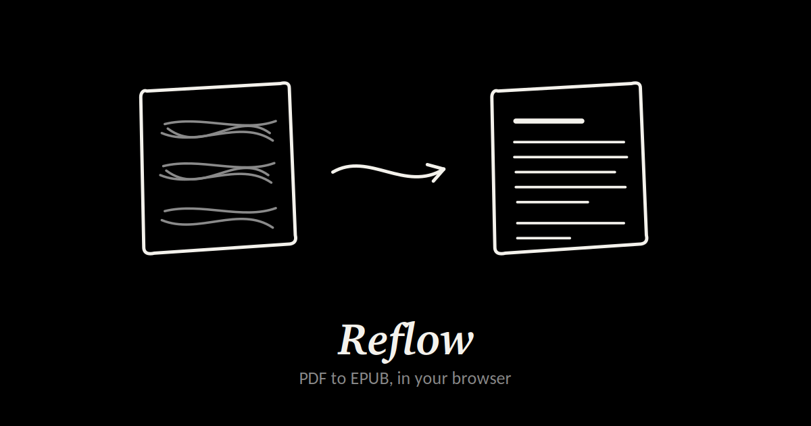

# Reflow

**Live at [reflow-7gz.pages.dev](https://reflow-7gz.pages.dev/)**

Convert a PDF into an EPUB that actually reflows. Runs entirely in the browser —
no server, no upload, no account.



## Why

Free PDF-to-EPUB converters tend to produce one of two things: a paywall, or an
EPUB where the text sits on top of itself in an unreadable tangle. The second
happens because the converter preserves the PDF's absolute coordinates as CSS
positioning. Nothing wraps, so nothing is readable on a phone or an e-reader.

Reflow was built because I had a manuscript I could only read as an EPUB, and
nothing free would give me a usable one.

## What it does

- Rebuilds real paragraphs from the PDF's text layer instead of preserving page layout
- Finds chapters from the PDF's bookmarks, or by reading the book's own contents page
- Extracts images and places them back in the text at the right point
- Detects a cover
- Strips running heads, page numbers, and hyphens broken across line endings
- Lets you rename, reorder, merge and remove chapters before exporting
- Writes a valid EPUB 3 with a working table of contents, plus an NCX fallback for older readers

## How it works

**Paragraphs.** Every text run in a PDF carries an absolute position. Reflow uses
those coordinates once — to establish reading order and where lines break — then
throws them away. Lines are grouped into paragraphs using vertical gaps,
first-line indents, and whether the previous line stopped short of the right
margin with a closed sentence. The output carries no positioning at all, which is
why it reflows.

**Chapters.** Bookmarks are the most reliable source, so they come first. Most
PDFs don't have them, so the fallback is the book's own contents page: Reflow
finds it, parses the entries, then walks forward through the body matching each
title to the line where that chapter actually begins. Font-size heuristics are the
last resort, with guards against the obvious traps — a line ending on a dangling
word is never a title, and adjacent headings with no text between them are one
heading, not two.

**Images.** Pulled from the page's operator list, with the current transformation
matrix tracked through save/restore/transform so each image's position on the page
is known. That position is what places it correctly in the text flow. Artwork
repeating on more than half the pages is treated as a logo and dropped.

**Packaging.** JSZip, with the `mimetype` entry written first and uncompressed, as
the EPUB specification requires.

## Privacy

There is no backend. The PDF is read with the File API and never leaves the
device. No analytics, no cookies, and no network requests once the page has
loaded.

## Running it locally

Clone the repository and serve the folder over HTTP:

```
python3 -m http.server 8000
```

Then open `http://localhost:8000`. Opening `index.html` straight from the
filesystem won't work, because the PDF worker needs a real origin.

## Limitations

- A scanned PDF has no text layer and won't convert. It needs OCR first.
- Multi-column pages interleave into nonsense, since lines are grouped by vertical position.
- Tables, footnotes and hand-set layout don't survive as structure.
- Very large books are bounded by available memory, since everything is held in the tab.

## Third-party code

`vendor/` contains two unmodified open-source libraries:

- [pdf.js](https://github.com/mozilla/pdf.js) 3.11.174 — Apache-2.0
- [JSZip](https://github.com/Stuk/jszip) 3.10.1 — MIT

They are vendored rather than loaded from a CDN so the tool can't break when
someone else's URL changes, and so it works offline.
